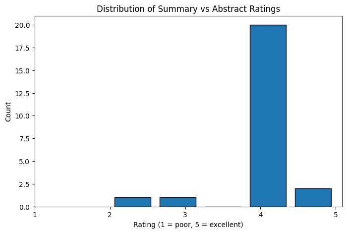

# LLMs & Summarizing Peer-Reviewed Psychology Papers

This repository holds an attempt to use a large language model to summarize open source, peer-reviewed psychology research papers while using their respective abstracts as a source of comparison for LLM output quality.

## Overview

The goal of this project was to explore how well a large language model could create a meaningful and articulate summary of a research paper solely using the body of the paper. This problem required an input of a well-organized JSON file containing the abstracts, bodies, and file names of each paper, with an expected outcome of a concise and accurate summarization of the paper. Separating the abstract of the paper from the body allowed use of the same LLM model to compare between the created summary and the extracted abstract. Comparison was done with the same LLM model used to summarize, gpt-3.5-turbo, and was prompted to use a scale of 1-5 and give a short explanation for each comparison for visualization and comprehension purposes. Both iterations did relatively well at summarizing, and had an average score of between 3.6 - 3.9 out of 5. 

## Summary of Workdone

### Data

* Data:
  * Type: open-source .pdf files downloaded [here](https://www.ncbi.nlm.nih.gov/)
    * Input: .pdf files, with text later extracted for ease of use
    * Output: .json files containing summaries and comparisons created by the LLM
  * Size: 25-50 .pdf files used
  * The first iteration used only 25 unique papers, and the second iteration used 50 unique papers, including the 25 from the first iteration

#### Preprocessing / Clean up

* In order to present the LLM with only the body of each research paper, it was necessary to create functions using PyMuPDF to extract parts of the text based off of relevant headings and text formatting
* Files are required to be in organized directories to avoid the inclusion of unwanted files, which was done using terminal commands

### Problem Formulation

* Input: JSON file containing separated 'abstract' and 'body' text
* Output: JSON file containing only the 'abstract' and 'summary' text created from LLM
* Models: I chose to work with OpenAI's gpt-3.5-turbo model in order to balance cost, speed, and capability
* Metric: a generated rating scale of 1-5 created by gpt-3.5-turbo after being prompted to give a numeric rating and a short text explanation

### Training

* Software: Python 3.10 in a virtual environment, Jupyter Notebook
* Hardware: personal Macbook Air
* Difficulties: I did my data collection manually, which limited the ability to train on a larger dataset of research papers. It was also difficult balancing the cost of the token usage and token limits that gpt-3.5-turbo has, which required me to work through chunking the bodies of the paper to avoid overusage of tokens and approaching the token limit.

### Performance Comparison

Key performance metric: Average rating between 1-5

### Conclusions

* State any conclusions you can infer from your work. Example: LSTM work better than GRU.

### Future Work

* What would be the next thing that you would try.
* What are some other studies that can be done starting from here.

## How to reproduce results

* In this section, provide instructions at least one of the following:
   * Reproduce your results fully, including training.
   * Apply this package to other data. For example, how to use the model you trained.
   * Use this package to perform their own study.
* Also describe what resources to use for this package, if appropirate. For example, point them to Collab and TPUs.

### Overview of files in repository

* Describe the directory structure, if any.
* List all relavent files and describe their role in the package.
* An example:
  * utils.py: various functions that are used in cleaning and visualizing data.
  * preprocess.ipynb: Takes input data in CSV and writes out data frame after cleanup.
  * visualization.ipynb: Creates various visualizations of the data.
  * models.py: Contains functions that build the various models.
  * training-model-1.ipynb: Trains the first model and saves model during training.
  * training-model-2.ipynb: Trains the second model and saves model during training.
  * training-model-3.ipynb: Trains the third model and saves model during training.
  * performance.ipynb: loads multiple trained models and compares results.
  * inference.ipynb: loads a trained model and applies it to test data to create kaggle submission.

* Note that all of these notebooks should contain enough text for someone to understand what is happening.

### Software Setup
* List all of the required packages.
* If not standard, provide or point to instruction for installing the packages.
* Describe how to install your package.

### Data

* Point to where they can download the data.
* Lead them through preprocessing steps, if necessary.

### Training

* Describe how to train the model

#### Performance Evaluation

* Describe how to run the performance evaluation.

## Citations

* Provide any references.

