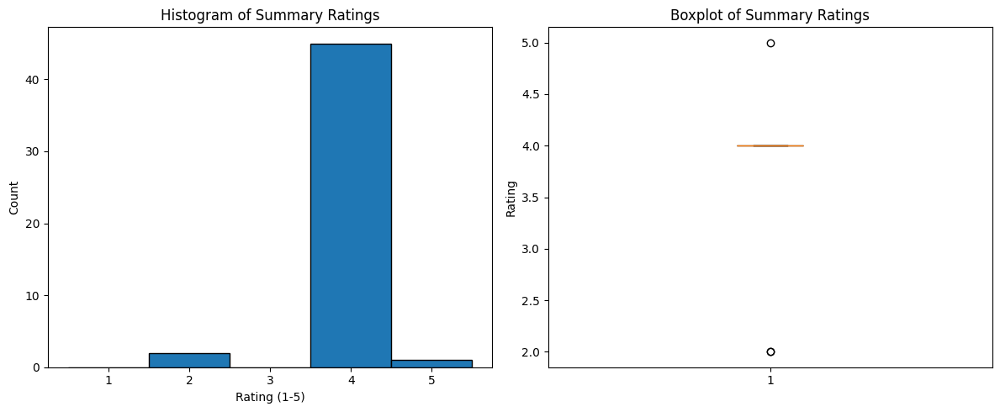

# Using Large Language Models to Summarize Peer-Reviewed Psychology Papers

This repository demonstrates utilizing a large language model to summarize open source, peer-reviewed psychology research papers while using their respective abstracts as a source of comparison for LLM output quality.

## Overview

The goal of this project was to evaluate how effectively a large language model can generate meaningful and articulate summaries of research papers using only the paper's body text. Input data consisted of a well-structured JSON file containing the abstracts, bodies, and file names of each paper, with an expected outcome of a concise and accurate summarization of the paper. Separating the abstract of the paper from the body enabled using the same LLM model (GPT-3.5-turbo) to compare the generated summary against the original abstract. The comparison involved rating summaries on a scale from 1 to 5, accompanied by brief explanations to aid visualization and understanding. Both iterations performed reasonably well, with an average rating of 3.9 out of 5.

## Summary of Work Done

### Data

* Data:
  * Type: Open-source PDF files downloaded [here](https://www.ncbi.nlm.nih.gov/)
    * Input: PDF files, with text later extracted for ease of use
    * Output: JSON files containing LLM-generated summaries and comparison results
  * Size: 25-50 PDF files used
  * The first iteration used 25 unique papers, while the second iteration used 50 (including the initial 25)

#### Preprocessing / Clean up

* Functions were developed using PyMuPDF to extract specific parts of the text based on relevant headings and formatting, isolating the paper body
* Files were organized into directories to prevent processing unwanted files, with organization managed via terminal commands

### Problem Formulation

* Input: JSON file containing separate `'abstract'` and `'body'` text fields
* Output: JSON file containing only the `'abstract'` and generated `'summary'` text fields
* Models: OpenAI's GPT-3.5-turbo model was chosen in order to balance cost, speed, and capability
* Metric: GPT-3.5-turbo generated a numeric rating (1-5) and a brief explanation to evaluate summary quality

### Training

* Software: Python 3.10 in a virtual environment, Jupyter Notebook used for development
* Hardware: personal Macbook Air
* Difficulties: Data collection was done manually, limiting the ability to train on a larger dataset of research papers. Managing token usage and limits of GPT-3.5-turbo required chunking paper bodies to avoid exceeding token limits.

### Performance Comparison

Key performance metric: Average rating between 1-5

The image below displays a histogram plotting the distribution of scores using only 25 PDFs

The image below displays a histogram and boxplot visualizing the distribution of scores using 50 total PDFs

**Below are some ratings and justifications created using 50 papers to summarize**

> new18.pdf (Rating: 5):
> The summary provides a comprehensive overview of various topics in psychology research, including neural and cognitive modeling, cognitive behavioral therapy, affect regulation, and more. It effectively highlights key authors and concepts
> discussed in the text.

> new24.pdf (Rating: 2):
> The abstract provides a detailed description of the study inclusion and exclusion criteria, search strategy, data extraction, quality appraisal, synthesis of results, and study characteristics. However, it lacks a clear and concise summary of > the key findings and implications of the research. The summary, on the other hand, provides a more focused overview of the study findings related to psychological stress after stroke, highlighting the predictors of stress and the impact on
> functional and emotional outcomes. However, it lacks the depth and detail provided in the abstract.

> psychpaper14.pdf (Rating: 4):
> The abstract provides a comprehensive overview of the research study, outlining the problem, methodology, findings, and implications. It effectively summarizes the key points of the research paper and highlights the significance of the study
> in addressing consumer behavior on e-commerce platforms. The abstract is well-structured and provides clear insights into the research findings.

### Conclusions

After increasing the amount of research papers used for summarization and comparison, there were less excellent and less below average ratings, but not a significant change in the mean of the ratings (a 0.02 change from 25 to 50 papers). I believe the size of data the LLM was given significantly hurt the performance of the models, alongside comparing different models that are both newer and older than GPT-3.5-turbo.

### Future Work

To meaningfully expand on this project, I would like to try:
* Automating PDF downloads to increase overall data set size
* Work with a variety of models, such as GPT-4 or GPT-3.5-turbo-16k
* Increasing the difficulty or phrasing of the prompts to require stricter grading on summaries
* Adjusting the summarization prompts for clarity or concision

## How to reproduce results

* In this section, provide instructions at least one of the following:
   * Reproduce your results fully, including training.
   * Apply this package to other data. For example, how to use the model you trained.
   * Use this package to perform their own study.
* Also describe what resources to use for this package, if appropirate. For example, point them to Collab and TPUs.

### Overview of files in repository

* The directory containing all research papers required organization before it could be used
* extraction_separation_initial.ipynb: separates the intial 25 PDFS between their `'abstracts'` and `'bodies'`, and saves this output to a JSON file
* summarize_initial.ipynb: prompts LLM to generate summaries of each paper body and saves this output to a JSON file
* comparison_initial.ipynb: prompts LLM to generate comparison ratings and explanations between each `'abstract'` and `'body'`, and saves this output to a JSON file
* stat_visualization_inition.ipynb: visualizes comparison ratings for the first attempt
* extraction_separation_iteration2.ipynb: separates the 50 PDFS between their '`abstracts'` and `'bodies'`, and saves this output to a JSON file
* summarize_iteration2.ipynb: prompts LLM to generate summaries of each paper body and saves this output to a JSON file
* comparison_iteration2.ipynb: prompts LLM to generate comparison ratings and explanations between each `'abstract'` and `'body'`, and saves this output to a JSON file
* stat_visualization_iteration2.ipynb: visualizes comparison ratings for the second attempt

### Software Setup
* Required packages:
  * json
  * NumPy
  * matplotlib
  * pathlib
  * dotenv
  * openai
  * time
  * PyMuPDF

All packages can be installed using `pip` command in terminal or notebook

### Data

* All data can be downloaded from [here](https://www.ncbi.nlm.nih.gov/) using the given search feature

